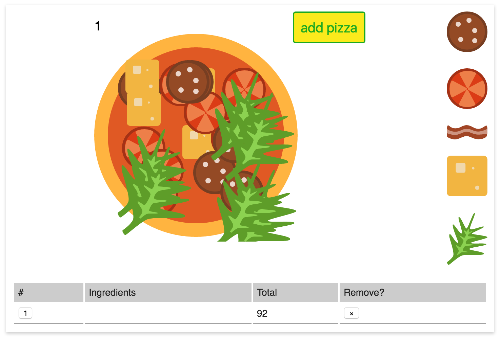

# Pizza App

## Installation
Install dependencies: `npm i`

## Development
1. Start bundler: `npm start`
2. Start dev server: `npm run server`
3. Open http://localhost:3000 in your browser

## Assignment
Develop shopping basket application with pizza constructor in plain JavaScript.

- Entry point file should be `src/index.js`
- Static markup is in `index.html` already
- Dynamic HTML which you'll need to use in JavaScript is annotated with comments in `index.html` (extract those parts into templates)
- Ingredients config is in `public/config.json`

### Part 1
Develop dynamic table to display orders

- When `add pizza` button is pressed, add a new row into the table
- Use template of the row item from `index.html`
- Every row should have appropriate order number
- When `×` is pressed, remove corresponding row
- When removing a row, update order numbers
- Values in `Total` column are dynamic, initial value is price of an empty pizza
- Load `public/config.json` and use that JSON data to render available ingredients
- When a button with a number of the row is pressed, mark this row as currently selected
- When choosing an ingredient, update the value in `Total` column of the currently selected row with a price value of that ingredient

### Part 2
Develop pizza constructor

- When a new pizza is added, add an empty pizza to the constructor
- When a row in the table is removed, remove pizza from the constructor
- Every pizza should have order number in top left corner
- When selecting an order from the table, show corresponding pizza in constructor
- Switching between pizzas in constructor should be animated
- When removing currently selected row, switch to previous pizza
- When adding ingredients, place selected ingredients onto current pizza
- Place ingredients to random location within a pizza

## Bonus
- Display a list of selected ingredients (name of an ingredient) for each pizza in `Ingredients` column
- When an ingredient is pressed, remove it from the list and remove corresponding ingredient from constructor view
